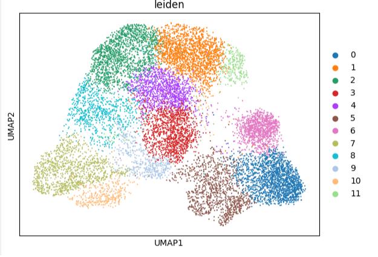

# Predictive Modeling of CAR-T Cell Functional States

A project by **Jadheer Ahsan kizhakkepurath** ([GradSyntax](https://github.com/GradSyntax)).

### **➡️ [View the Live Interactive Demo on Hugging Face Spaces](https://huggingface.co/spaces/gradsyntax/cart-cell-predictor)**

---

## 1. Project Objective

This project uses public single-cell RNA sequencing (scRNA-seq) data (GEO: **GSE262686**) to build a machine learning model capable of predicting the functional cluster identity of individual CAR-T cells. This work serves as a portfolio project demonstrating an end-to-end workflow in computational biology, from raw data processing to model deployment and interpretation.

## 2. Core Workflow & Technologies

* **Data Processing:** Raw data was processed using **Scanpy** for quality control, normalization, and feature selection.
* **Cell Clustering:** Unsupervised clustering with the Leiden algorithm revealed 12 distinct cell populations.
* **Model Training:** A `RandomForestClassifier` was trained using **scikit-learn** to predict a cell's cluster based on the 2,000 most variable genes.
* **Experiment Tracking:** **Comet.ml** was used to log all model parameters, metrics (82% accuracy), and artifacts for reproducible research. **[Link to your Public Comet Project]**
* **Deployment:** The final model was deployed as an interactive web application using **Gradio** and **Hugging Face Spaces**.

## 3. Key Results

The model successfully predicted cell cluster identity with **~82% accuracy**. The UMAP visualization below shows the 12 distinct cell populations identified by the Leiden clustering algorithm.

*(To add this image: take a screenshot of your colorful UMAP plot, name it `analysis_notebook_umap.png`, and upload it to this GitHub repository. This link will then work automatically.)*

#### Top Predictive Genes
The model's decisions were most influenced by the following genes, suggesting their importance in defining different CAR-T cell states:

*(Here, you can list the top 5-10 genes from your `top_20_important_genes.csv` file)*
* Gene 1
* Gene 2
* Gene 3
* ...

## 4. How to Run This Project Locally

1.  Clone this repository.
2.  Install dependencies: `pip install -r requirements.txt`
3.  Run the `analysis_notebook.ipynb` Jupyter Notebook for data exploration or `train.py` for model training.
